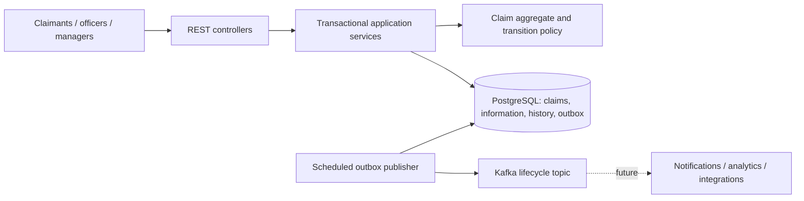
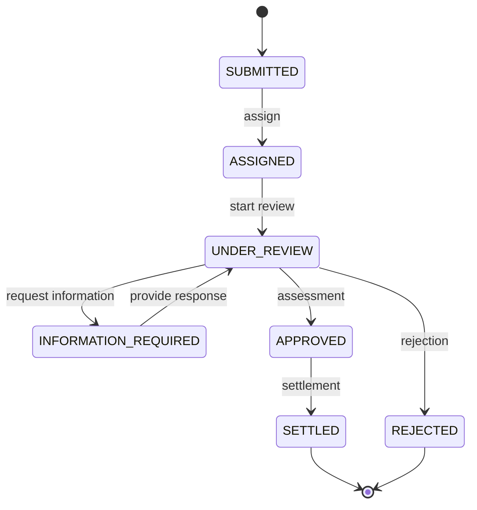
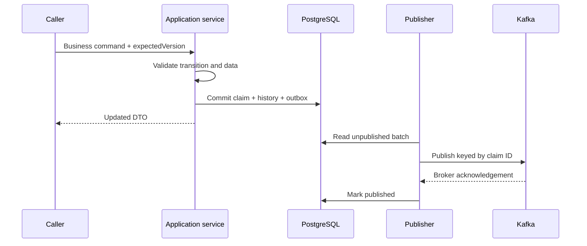

# Architecture and decisions

## Context and domain decomposition
Claimants submit and track motor/property claims; officers assign, review, request information and decide them. Managers inspect workload and outstanding liability. Frontend is excluded.

One Java 17 / Spring Boot 3 modular monolith owns a PostgreSQL database. Packages are domain boundaries, not separately deployed services: `claim` owns the aggregate and API; `workflow` owns state policy and history; `assignment` owns pickup; `workload` and `exposure` own operational queries; `event` owns durable event publication; `common` owns HTTP errors and correlation IDs. Dependencies point towards claim/domain rules. Controllers do not implement business rules.

## Core entities and lifecycle
Claim: UUID, unique claim number, MOTOR/PROPERTY, market, claimant, incident/date, reported/updated times, assigned officer, estimate, approved settlement, reason and JPA version. Information request belongs to one claim and is OPEN or PROVIDED. Only one request may be open; responses target its ID. History records each command and old/new state. Outbox records an event envelope without free-text claimant data.

Assessment is approval in this MVP. Settlement records completion; it does not transfer money. No reopening, reassignment or arbitrary state overwrite. State policy validates edges and aggregate methods enforce required data. Mutations require expectedVersion; stale writes return 409 and JPA optimistic locking closes the race after checking it.

## REST and events
REST is used for create/get/status/list, assignment, review, information request/response, assessment, settlement, rejection, history, workload and exposure because callers need immediate validation/results. Commands publish ClaimCreated, ClaimAssigned, ClaimReviewStarted, AdditionalInformationRequested, AdditionalInformationProvided, ClaimAssessed, ClaimSettled and ClaimRejected. Kafka is an asynchronous integration boundary; there is no artificial consumer that only logs events. Reporting reads committed PostgreSQL state directly.

## Data and query design
Flyway owns schema; Hibernate validates it. UUID identifiers and claim numbers are unique. Monetary values use NUMERIC(19,2). Indexes cover status, officer, status/officer, information claim ID, history claim/time and pending outbox rows. Lists are paginated with bounded size and stable ordering. Workload groups nonterminal claims by officer/status, separately counts unassigned claims, and computes terminal decision counts/average completion time in SQL. Exposure is SUM(estimated_liability), COUNT(*) excluding SETTLED/REJECTED, including APPROVED; empty sum is zero. All amounts are assumed USD reporting currency; no cross-market FX is performed.

## Transactions, consistency and resilience
Business commands run in one database transaction: aggregate, history and outbox all succeed or all roll back. Kafka availability does not block commands. Publisher waits for acknowledgement before marking rows; failure leaves them pending with retry metadata. The lightweight publisher assumes ONE application instance. Crash after Kafka acknowledgement but before DB commit causes duplicates. Delivery is at least once under eventual broker recovery, not exactly once; consumers must deduplicate eventId and handle aggregateVersion. No guarantee of strict ordering across failed batches. Production evolution: per-aggregate sequencing, backoff/dead-letter operations, retention, backlog monitoring and multi-instance SKIP LOCKED/CDC publishing. Avoid network waits in DB transactions in that evolution. Batches are bounded to 20 records and publication stops at the first failed send; fixed retries can block later events behind a persistently failing oldest event.

## Scalability, security and observability
Start with indexed SQL and bounded pagination; use query plans before adding read replicas/materialized views. Split deployable services only when team ownership or scaling warrants it. Production uses OAuth2/OIDC/JWT with CLAIMANT ownership and CLAIMS_OFFICER/MANAGER authorization. Local assessment deliberately has no authentication and must not be publicly exposed. Validate input, use JPA/parameterized SQL, externalize credentials, avoid payload/PII logs and return safe errors. Correlation IDs appear in responses/logs. Actuator exposes health/info only; database health reports connectivity. Outbox failures are logged by event ID/type, not payload. Kafka outage tolerance does not mean overall integration health is monitored.

## Assumptions and ADR trade-offs
1. Modular monolith: coherent transactions and small operational footprint; package separation permits later extraction.
2. Intent-based REST: explicit operations over generic entity patches to preserve lifecycle invariants.
3. Lightweight outbox: more reliable than DB/Kafka dual writes, with single-instance/retry limitations acknowledged.
4. Reporting from source tables: immediate correctness without CQRS framework, eventual materialization if scale demands it.
5. Provisional markets AU, NZ, SG, HK, MY, TH: assessment assumption, not a claim about actual Chubb market scope.
6. USD normalized amounts, one open request, external officer identifiers, no payment execution: bounded assessment model.
7. No fake IAM, frontend, attachments, policy verification, advanced analytics, Kubernetes or caches.

## Validation approach and observed results
Focused rule, service, API and publisher tests; database-backed application flow on H2 for default tests; explicit PostgreSQL/Testcontainers test when Docker is available. H2 does not establish PostgreSQL compatibility. Java 17 clean verification packaged the application with 22 passing tests and one explicit PostgreSQL test skipped. Tests prove transaction rollback, concurrent optimistic locking, actual HTTP health/OpenAPI/Swagger and business flows. A standalone test-only H2 startup and the PowerShell lifecycle smoke script also passed. Compose parsing passed; full Compose startup was blocked by Docker engine permissions, and explicitly enabling Testcontainers failed for lack of an accessible Docker environment. PostgreSQL runtime and real Kafka delivery are not validated.

Operational summaries use two database queries under default READ COMMITTED isolation, so workload/performance counts are not guaranteed to share a single snapshot during concurrent writes. Exposure uses one aggregate query. These are operational views, not reconciled financial reports. Production financial reporting requires confirmed currency rules, explicit snapshot requirements and reconciliation.
