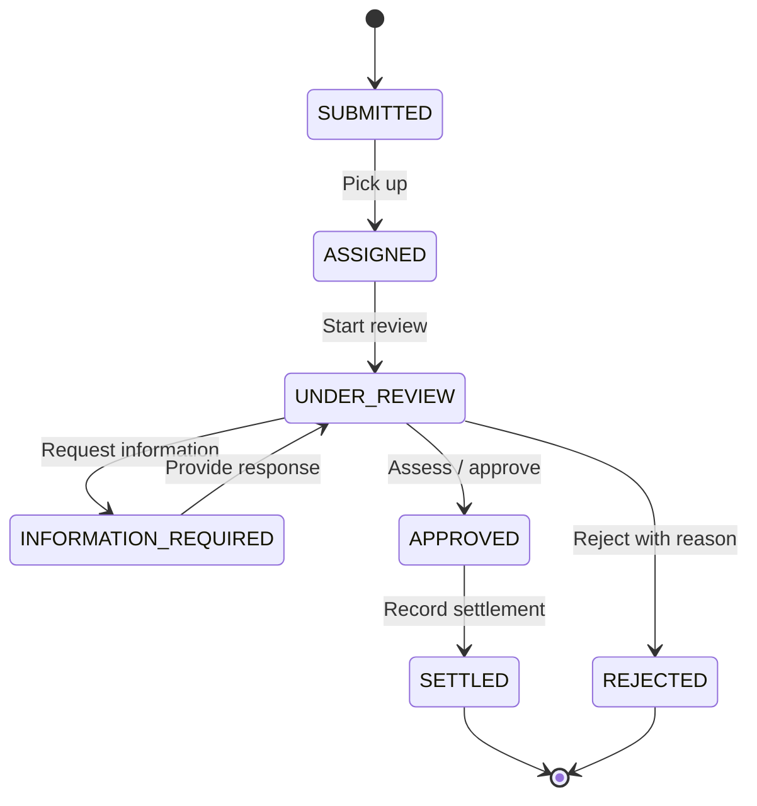

<div align="center">

# APAC Claims Backend

**Motor & property claims · Explicit workflows · Traceable decisions**

A modular Java backend assessment for **Chubb APAC**.


[Quick start](#quick-start) · [Build & test](#prerequisites-and-build) · [API guide](#api-usage) · [Validation](#validation-record) · [Architecture](ARCHITECTURE.md) · [AI journal](AI_WORKING_JOURNAL.md)

</div>

---

## What this solves

A small modular monolith replacing shared inboxes and spreadsheets with explicit, traceable claim workflows. Frontend is out of scope.

| Who | What they can do |
| :--- | :--- |
| **Claimants** | Submit incidents, track claims, answer information requests and retrieve decisions |
| **Claims officers** | Pick up, review, request information, approve, settle or reject claims |
| **Managers** | View team workload, decision counts, completion time and outstanding exposure |

> **Validation snapshot:** badges reflect recorded local results, not live CI status. Java 17 and embedded Kafka checks passed; full Docker/PostgreSQL startup is blocked by local engine permissions. [See validation details.](#validation-record)

## Quick start

**Prerequisites:** Docker Desktop on Windows with the **WSL2 backend**, Docker Desktop on macOS, or Docker Engine on Linux; Compose v2+; working engine access; and free ports **8080 / 5432 / 9092**. The first build requires internet access.

```powershell
Copy-Item .env.example .env
# Edit .env and choose a local DB_PASSWORD
docker compose up --build
```

On Linux/macOS, replace the first command with `cp .env.example .env`.

| Explore | Local URL |
| :--- | :--- |
| **Swagger UI** | [Open interactive API docs](http://localhost:8080/swagger-ui/index.html) |
| **Health** | [Check application health](http://localhost:8080/actuator/health) |
| **OpenAPI** | [View the API specification](http://localhost:8080/v3/api-docs) |

Run the complete demo flow with `.\scripts\smoke.ps1`. [More startup options ↓](#run-the-complete-local-stack)

## Stack

| Layer | Technology |
| :--- | :--- |
| **Runtime & build** | Java 17 · Spring Boot 3.5.7 · Maven 3.9.11 Wrapper |
| **HTTP & contracts** | Spring Web · Bean Validation · OpenAPI / Swagger |
| **Persistence** | Spring Data JPA · PostgreSQL 16 · Flyway |
| **Events** | Apache Kafka KRaft · Spring Kafka · Transactional outbox |
| **Verification** | JUnit 5 · Mockito · H2 · Testcontainers · Embedded Kafka |
| **Operations** | Docker Compose · Actuator · Correlation IDs |

Springdoc compatibility follows the [official matrix](https://springdoc.org/v2/); Kafka uses the [official Apache JVM image](https://kafka.apache.org/39/getting-started/docker/).

## Prerequisites and build

- JDK **17** and `JAVA_HOME` pointing to it; no global Maven installation required.
- Internet on the first build for Maven/dependencies.
- Docker Desktop on **Windows with the WSL2 backend**, Docker Desktop on **macOS**, or Docker Engine on **Linux**, with working engine access and Docker Compose v2 or later.
- On Windows, Docker Desktop must use **Linux-container mode** because the PostgreSQL, Kafka and Java images are Linux-based. The host operating system can still be Windows.
- Available localhost ports 8080, 5432 and 9092.

### Windows PowerShell

```powershell
.\mvnw.cmd clean verify
.\mvnw.cmd test
```

<details>
<summary><strong>Linux / macOS build commands</strong></summary>

```bash
chmod +x mvnw
./mvnw clean verify
./mvnw test
```

</details>

The default suite covers domain rules, H2-backed application/API flows, rollback, concurrent pickup, real HTTP checks and publisher failure paths. An **embedded Kafka KRaft integration test** verifies actual publication, consumption and the durable published marker without Docker.

H2 is **test-only**; it does not prove PostgreSQL compatibility. The embedded broker does not validate the Compose configuration.

<details>
<summary><strong>PostgreSQL integration test — requires Docker</strong></summary>

The explicit PostgreSQL/Testcontainers test fails if the engine is unavailable:

```powershell
.\mvnw.cmd "-DpostgresIT=true" "-Dtest=PostgresIntegrationTest" test
```

For Bash, use `./mvnw -DpostgresIT=true -Dtest=PostgresIntegrationTest test`. The PostgreSQL test is deliberately skipped in the default suite and reported as such.

</details>

## Run the complete local stack

<details>
<summary><strong>Startup, logs, shutdown and persistence details</strong></summary>

First copy the credential template and choose a local password (the `.env` file is Git-ignored):

```powershell
Copy-Item .env.example .env
# Edit DB_PASSWORD in .env
docker compose up --build
```

On Linux/macOS use `cp .env.example .env`. Compose starts PostgreSQL and a single Kafka KRaft broker, explicitly creates the lifecycle topic, and then starts the application. The multi-stage Docker build runs the default tests with Java 17. Published ports bind to loopback. PostgreSQL data persists in a named volume; Kafka storage is ephemeral for this local demonstration.

- Health: http://localhost:8080/actuator/health
- Swagger UI: http://localhost:8080/swagger-ui/index.html
- OpenAPI JSON: http://localhost:8080/v3/api-docs

```powershell
docker compose logs -f app
docker compose down
```

`docker compose down` preserves the database. Changing the password after initial database creation also requires changing the stored PostgreSQL user's password; modifying `.env` alone does not do that.

</details>

## Run the JVM application against local dependencies

<details>
<summary><strong>JVM commands and environment configuration</strong></summary>

```powershell
docker compose up -d postgres kafka kafka-init
$env:DB_PASSWORD = '<same value as .env>'
.\mvnw.cmd spring-boot:run
```

Alternatively run `java -jar target/claims-0.0.1-SNAPSHOT.jar` after packaging. Bash: `DB_PASSWORD='<local password>' ./mvnw spring-boot:run`. Default dependencies are `localhost:5432` and `localhost:9092`; the Compose application uses internal service addresses. If using a separately provisioned broker, create `claims.lifecycle.v1` explicitly (3 partitions, appropriate replication for that environment).

Configuration: `DB_URL`, `DB_USER`, required `DB_PASSWORD`, `KAFKA_BOOTSTRAP_SERVERS`, `CLAIMS_TOPIC`, `EVENTS_ENABLED`. Set `EVENTS_ENABLED=false` only when deliberately testing without publication; outbox rows remain durable/pending.

</details>

## Claim lifecycle



**Intent-based commands** enforce these transitions. Every mutation requires the latest `expectedVersion`; invalid transitions and stale updates return **409 Conflict**.

## API usage

Create a claim (amounts are USD reporting currency). `curl` below denotes curl; on Windows use `curl.exe` or the PowerShell smoke script.

```bash
curl -i -X POST http://localhost:8080/api/claims \
  -H 'Content-Type: application/json' -H 'X-Correlation-ID: demo-request' \
  -d '{"claimType":"MOTOR","market":"SG","claimantName":"Demo claimant","incidentDescription":"Collision at junction","incidentDate":"2026-10-01","estimatedLiability":1000.00}'
```

Returns **201** with `Location`, claim ID/number, `SUBMITTED` status and version `0`. Substitute its ID below. Every mutation requires the current `expectedVersion`; use the returned version for the next command.

<details>
<summary><strong>Assign, review and retrieve claims</strong></summary>

```bash
curl http://localhost:8080/api/claims/CLAIM_ID
curl 'http://localhost:8080/api/claims?unassigned=true&page=0&size=20'
curl 'http://localhost:8080/api/claims?assignedOfficerId=officer-1&status=UNDER_REVIEW'
curl -X POST http://localhost:8080/api/claims/CLAIM_ID/assignment \
  -H 'Content-Type: application/json' \
  -d '{"expectedVersion":0,"officerId":"officer-1","officerName":"Demo officer"}'
curl -X POST http://localhost:8080/api/claims/CLAIM_ID/review \
  -H 'Content-Type: application/json' -d '{"expectedVersion":1}'
curl http://localhost:8080/api/claims/CLAIM_ID/status
curl http://localhost:8080/api/claims/CLAIM_ID/history
curl http://localhost:8080/api/exposure
curl http://localhost:8080/api/workload
```

</details>

Complete create → assign → review → request/answer information → approve → settle demonstration:

```powershell
.\scripts\smoke.ps1
```

The script creates a new demo claim on each invocation. It verifies health, settlement and seven history entries, then retrieves operational views. Inspect Kafka events independently:

<details>
<summary><strong>Inspect lifecycle events in Kafka</strong></summary>

```powershell
docker compose exec kafka /opt/kafka/bin/kafka-console-consumer.sh --bootstrap-server localhost:19092 --topic claims.lifecycle.v1 --from-beginning --timeout-ms 10000
```

</details>

<details>
<summary><strong>Complete endpoint reference and HTTP responses</strong></summary>

| Endpoint | Contract |
|---|---|
| `POST /api/claims` | Create: type, market, claimant, incident/date, estimate |
| `GET /api/claims/{id}` | Detail including information requests and decision |
| `GET /api/claims/{id}/status` | Status, version, updatedAt |
| `GET /api/claims/{id}/history` | Ordered lifecycle history |
| `GET /api/claims` | Optional status/officer/unassigned; page >=0, size 1–100 |
| `POST /api/claims/{id}/assignment` | expectedVersion, officerId, officerName |
| `POST /api/claims/{id}/review` | expectedVersion |
| `POST /api/claims/{id}/information-requests` | expectedVersion, question |
| `POST /api/claims/{id}/information-requests/{requestId}/response` | expectedVersion, response |
| `POST /api/claims/{id}/assessment` | expectedVersion, estimatedLiability, approvedSettlementAmount, reason |
| `POST /api/claims/{id}/settlement` | expectedVersion; records completion using approved amount |
| `POST /api/claims/{id}/rejection` | expectedVersion, reason |
| `GET /api/workload` | Open counts by officer/status, unassigned count, terminal counts/average completion seconds |
| `GET /api/exposure` | USD, totalOutstandingExposure, openClaimCount |

Commands return **200** updated detail; malformed/invalid input **400**, missing claim **404**, invalid transition/stale version **409**. Errors consistently contain timestamp, status, code, safe message, correlationId and fieldErrors. Error responses do not echo supplied values. Request correlation IDs accept only bounded alphanumeric/underscore/hyphen strings; otherwise one is generated.

</details>

## Business assumptions

<details>
<summary><strong>Markets, currency, decisions and operational metrics</strong></summary>

- MOTOR and PROPERTY; provisional markets **AU, NZ, SG, HK, MY, TH**. This is an assessment assumption, not confirmed Chubb scope.
- All amounts already normalized to **USD** by the caller. Nonnegative, at most two fractional digits. No FX conversion and no local-currency aggregation.
- An estimate is supplied at submission and may change during assessment. Exposure includes every nonterminal status, including APPROVED; empty exposure is zero.
- One open information request at a time. A provided response returns the claim to review. Additional cycles are permitted.
- Assessment approves; approved amount may differ from the estimate. Settlement records completion and does not initiate payment.
- Officer IDs are external identifiers. No officer registry, reassignment or terminal reopening.
- Workload is outstanding work. Performance is lifetime settled/rejected count and average report-to-terminal elapsed seconds, not officer productivity or SLA analytics. With no terminal claims, average is null.
- Incident dates use the domain's UTC date; application timestamps use UTC.

</details>

## Consistency and known limitations

<details>
<summary><strong>Delivery guarantees, publisher limits and production security</strong></summary>

Claim changes, lifecycle history and outbox inserts share a database transaction. Publication is retried asynchronously and waits for Kafka acknowledgement. A crash between acknowledgement and commit can duplicate an event; consumers must deduplicate `eventId` and handle `aggregateVersion`. Kafka producer idempotence is not end-to-end exactly once. Events intentionally omit claimant names/narratives and evidence.

The publisher assumes **one application instance**, holds a bounded batch transaction while waiting for Kafka, and uses fixed-delay retry without dead-letter tooling. A persistently failing oldest event blocks later events. There is no general strict event-ordering guarantee, consumer implementation, event retention job, or outbox backlog health/metrics. Kafka downtime does not block REST commands, but Actuator UP alone does not establish event delivery health. Database state is the authoritative reporting source.

This is a local assessment with no authentication; production needs OAuth2/OIDC/JWT, claimant ownership and officer/manager role checks. There are no attachments, policy adjudication, payment integration, notifications or UI. The single broker and plaintext listeners are local configuration; production needs replication, TLS/SASL, secrets management and broker operations. History traces state/operation/version but does not establish authenticated actor identity. Claims containing personal information require production retention/access controls.

</details>

## Validation record

**Recorded local results · Java 17.0.20.1 · `mvnw.cmd clean verify`**

| Check | Result | Evidence / scope |
| :--- | :---: | :--- |
| Clean build & executable JAR | ✅ Passed | Java 17 compilation, tests and packaging |
| Default test suite | ✅ **23 passed** | Domain, API, reporting, rollback and concurrency |
| Embedded Kafka KRaft | ✅ Passed | Real consumed event, privacy checks and publication marker |
| HTTP health, OpenAPI & Swagger | ✅ Passed | Running embedded HTTP server |
| Standalone lifecycle smoke | ✅ Passed | Seven operations and reporting on test-only H2, port 18080 |
| Compose configuration | ✅ Parsed | Configuration structure, not container startup |
| PostgreSQL integration | ⏸ **1 skipped** | Explicit opt-in attempt blocked by Docker access |
| Full Compose / image build | ⛔ Blocked | Docker engine named-pipe permission denied |

`docker compose config --quiet` passed. `docker compose up --build -d` could not start because access to the Docker engine named pipe was denied. Explicitly enabling the PostgreSQL/Testcontainers test also failed because no usable Docker environment was available. **PostgreSQL runtime, container image build and publication to the Compose Kafka broker remain unverified.** A Compose configuration parse is not container startup validation. See `AI_WORKING_JOURNAL.md` for the full evidence and corrections.

## Production evolution

Confirm markets/currency rules; introduce authenticated authorization and ownership; verify PostgreSQL and Kafka end-to-end in CI; add consumer idempotency and transactional integration contracts. Evolve publisher to CDC or coordinated multi-instance polling with per-claim sequencing, backoff/dead-letter recovery, retention and backlog alerts. Measure query plans and consider materialized reporting only when necessary. Extract services only when deployment/team boundaries justify the complexity.

## Further reading

| Document | Contents |
| :--- | :--- |
| [Architecture](ARCHITECTURE.md) | Domain boundaries, diagrams, consistency and ADR trade-offs |
| [AI working journal](AI_WORKING_JOURNAL.md) | Actual prompts, challenged decisions, corrections and validation evidence |

Git checkpoints reflect incremental implementation and verification.
